## 简介
* 本项目使用springboot2.0 + vue + element-ui,个人博客系统，颜控，自用，
* 管理后台使用若依开源构建【快捷方便，大佬威武，疯狂打call】，项目地址：https://gitee.com/y_project
## 演示站点
* 前台:http://www.miaoleyan.com
* 后台:http://www.miaoleyan.com/admin
* 视频：http://file.miaoleyan.com/dream-it-posssible.mp4
## 项目截图
  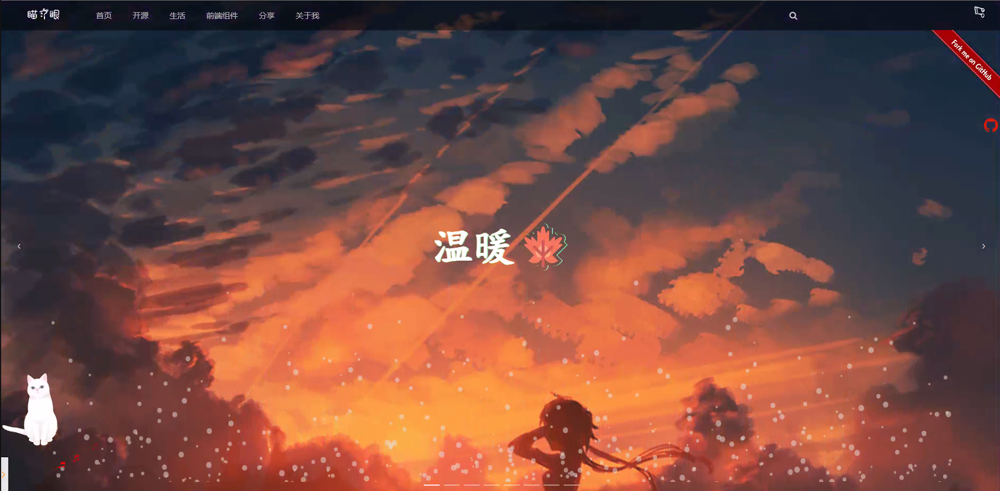
  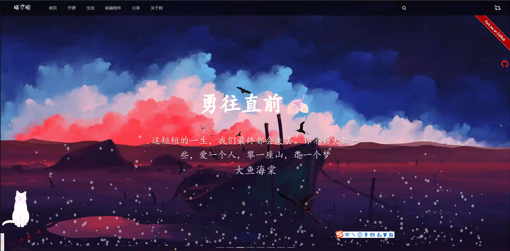
  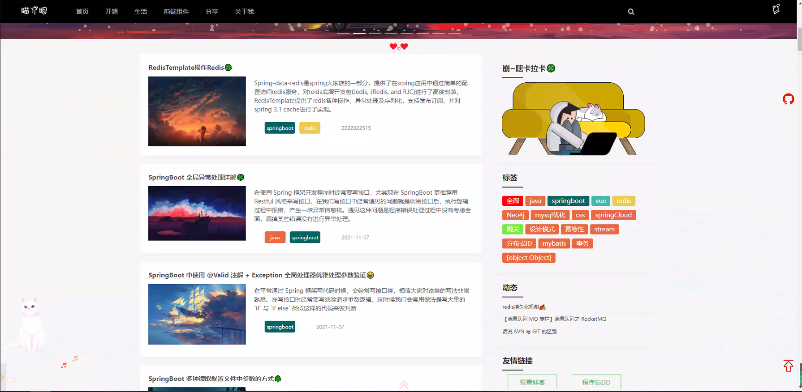
  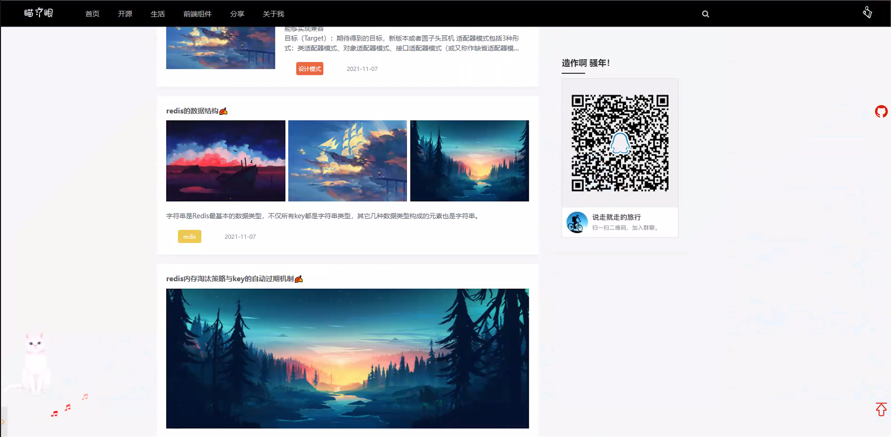
  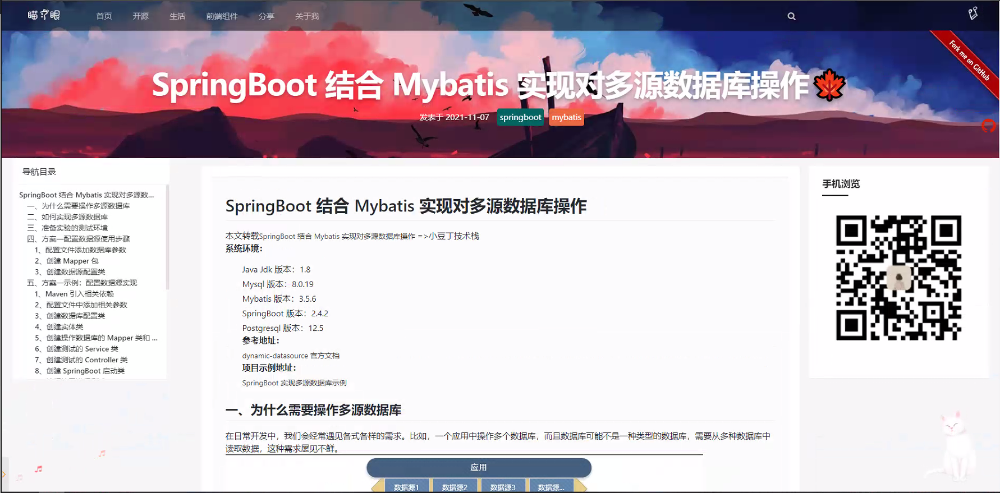
  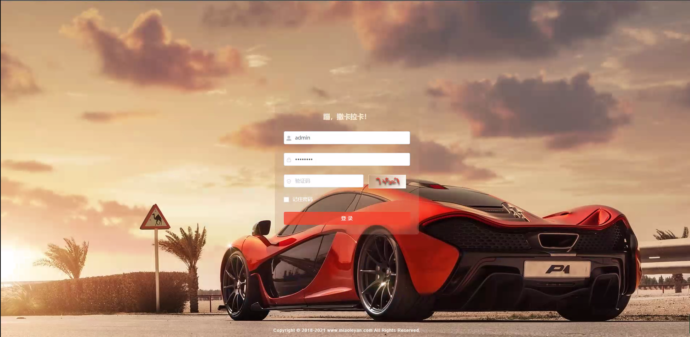
  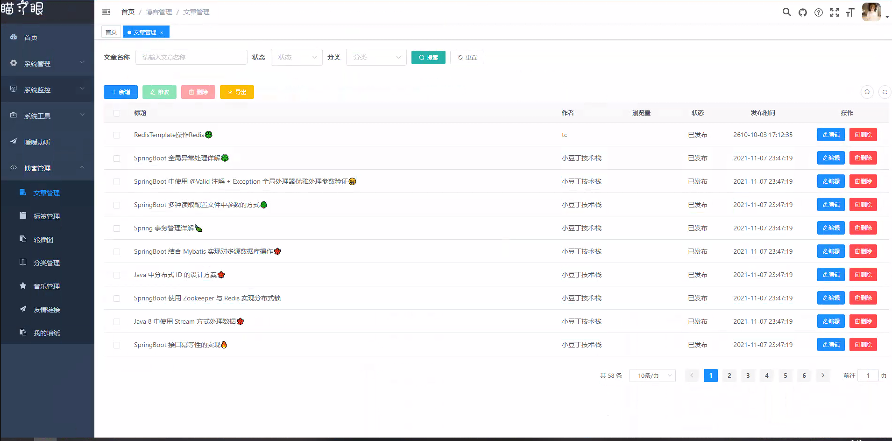
  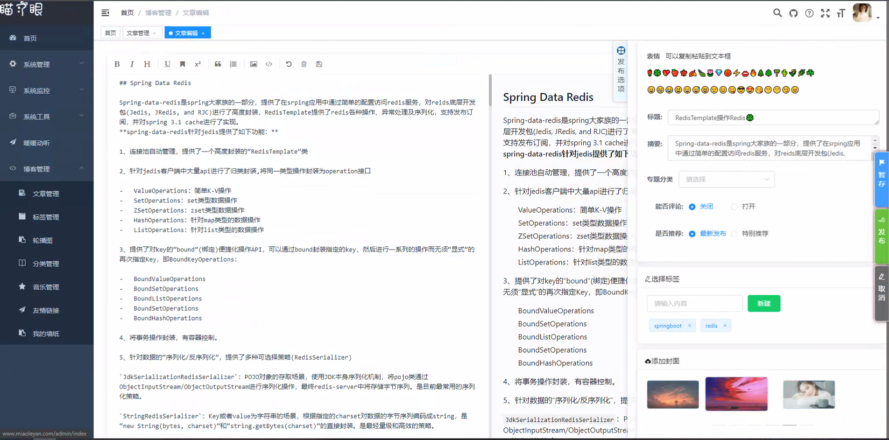
  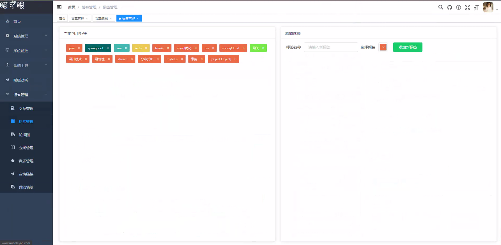
  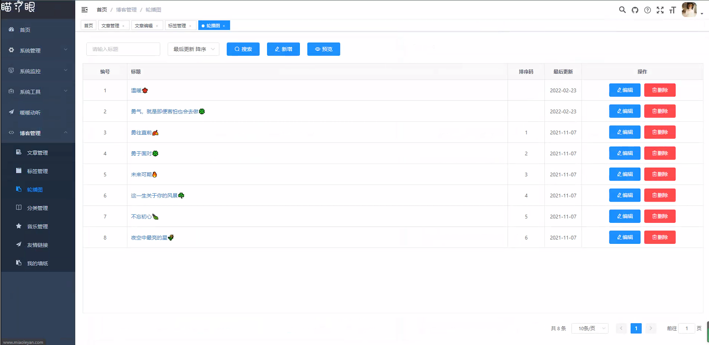
  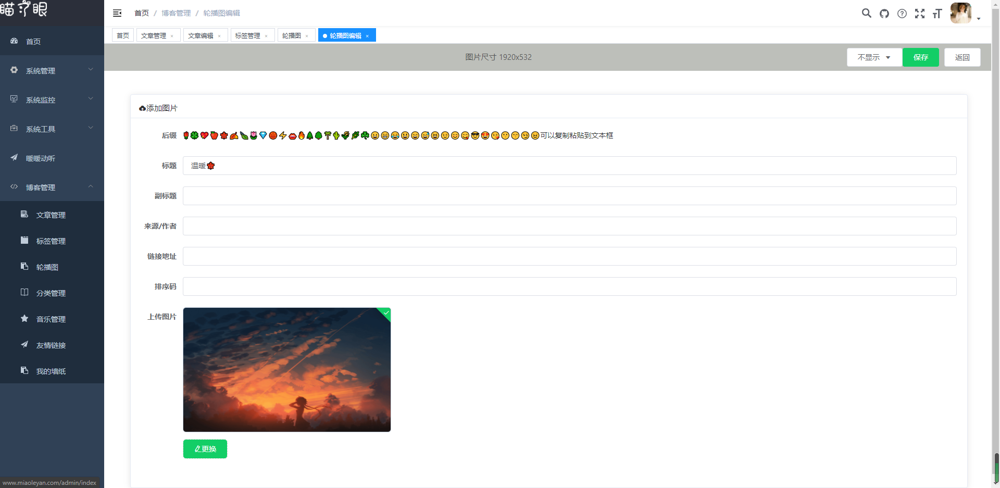
  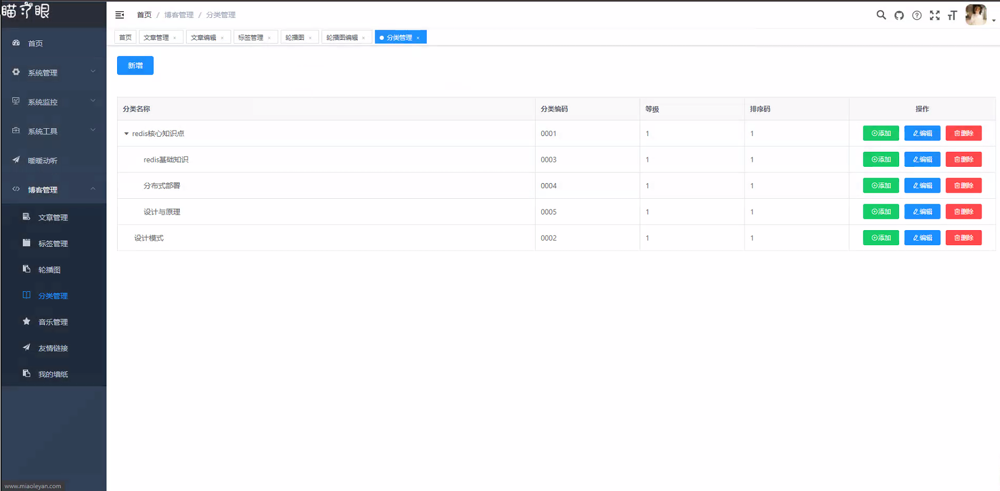
  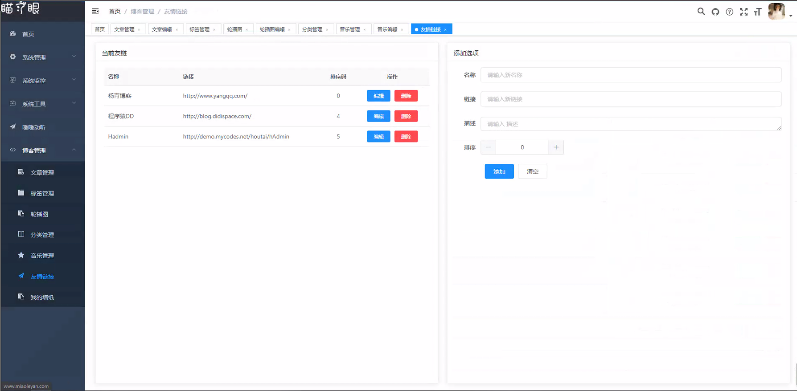
  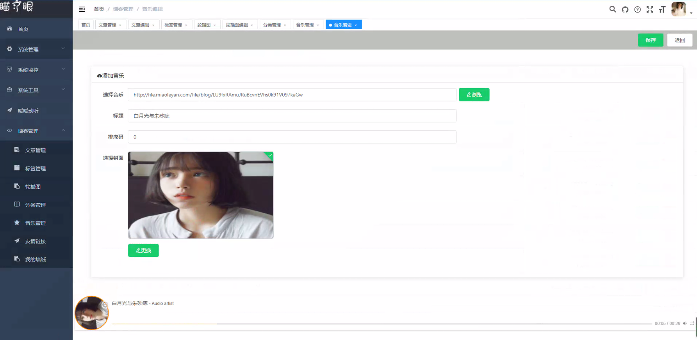
  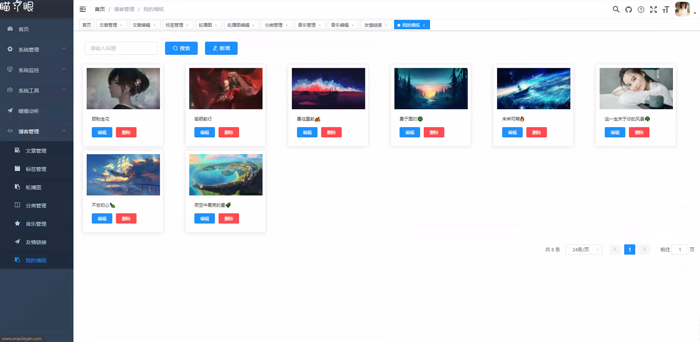

## 使用
* 0.找到sql文件夹吓得dream.sql,建库建表,代码里配置的库名是star-dream，自己改了对应的配置也要修改，在application-druid.yml
* 1.启动后端 ，先到dream-admin 模块，找到resource，修改application.yml和application-druid.yml,按提示修改成自己的参数（springboot项目，默认你已经会java这一套了，不会自己百度哈）
* 2.启动前端，先进入dream-ui,用命令行或者其他ide(如vscode等),先执行npm install,再npm run serve（先得安装nodejs，配置一下环境，不会自行百度）
* 3.访问localhost
* 4.有关图片上传，使用七牛云,请申请七牛云账号(白嫖40G空间)
* 5.后台管理页：http://localhost/admin 登录账号：admin 密码：123456,登陆后请点头像修改密码
## 交流

